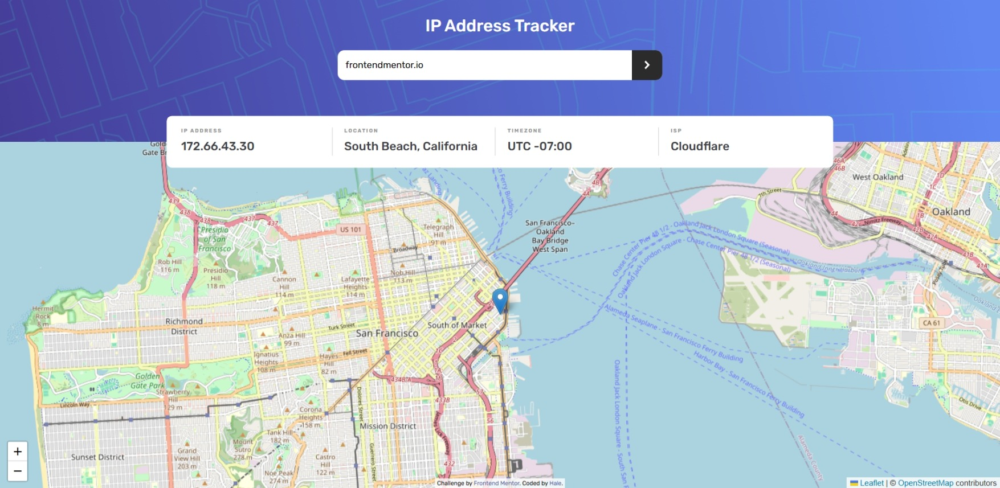

# Frontend Mentor - IP address tracker solution

This is a solution to the [IP address tracker challenge on Frontend Mentor](https://www.frontendmentor.io/challenges/ip-address-tracker-I8-0yYAH0). Frontend Mentor challenges help you improve your coding skills by building realistic projects.

## Table of contents

- [Overview](#overview)
  - [The challenge](#the-challenge)
  - [Screenshot](#screenshot)
  - [Links](#links)
- [My process](#my-process)
  - [Built with](#built-with)
- [Author](#author)

**Note: Delete this note and update the table of contents based on what sections you keep.**

## Overview

### The challenge

Users should be able to:

- View the optimal layout for each page depending on their device's screen size
- See hover states for all interactive elements on the page
- See their own IP address on the map on the initial page load
- Search for any IP addresses or domains and see the key information and location

### Screenshot

### Links

- Solution URL: [solution URL](https://github.com/halelite/ip-address-tracker.git)
- Live Site URL: [live site URL](https://ip-tracker-tool.netlify.app/)

## My process

### Built with

- Semantic HTML5 markup
- CSS custom properties
- Flexbox
- Mobile-first workflow
- [Typescript](https://www.typescriptlang.org/)
- [React](https://reactjs.org/) - JS library
- [Tailwind CSS](https://tailwindcss.com/) - CSS framework
- [TanStack Query (React Query)](https://tanstack.com/query/latest) - data-fetching library
- [Axios](https://axios-http.com/)

## Author

- Frontend Mentor - [@halelite](https://www.frontendmentor.io/profile/halelite)
- LinkedIn - [Hale Sheikhi](https://www.linkedin.com/in/hale-sheikhi/)
